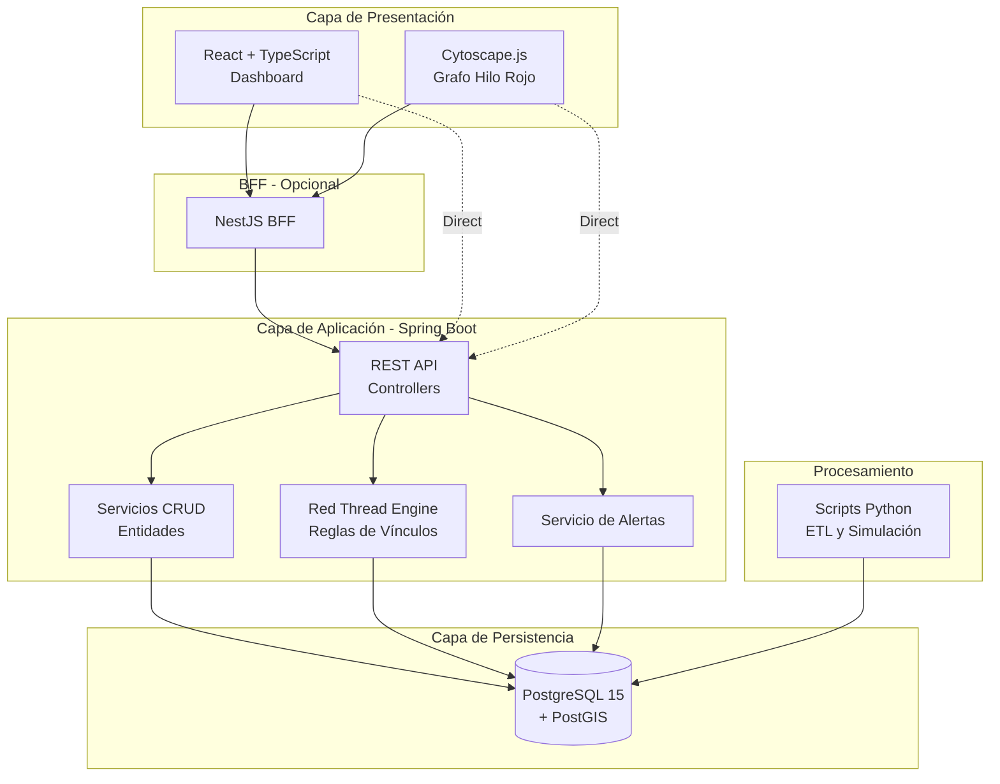
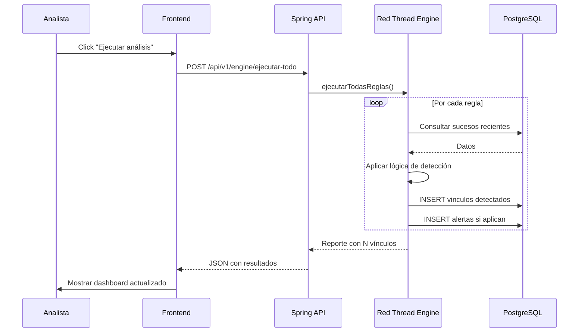
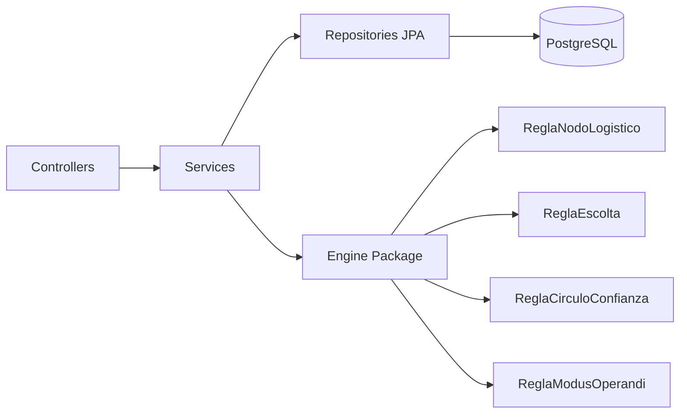

# Diagrama de Arquitectura

## Arquitectura general del sistema

```mermaid
graph TB
    subgraph "Capa de Presentación"
        UI[React + TypeScript<br/>Dashboard]
        GRAFO[Cytoscape.js<br/>Grafo Hilo Rojo]
    end

    subgraph "BFF - Opcional"
        NEST[NestJS BFF]
    end

    subgraph "Capa de Aplicación - Spring Boot"
        API[REST API<br/>Controllers]
        CRUD[Servicios CRUD<br/>Entidades]
        ENGINE[Red Thread Engine<br/>Reglas de Vínculos]
        ALERT[Servicio de Alertas]
    end

    subgraph "Capa de Persistencia"
        DB[(PostgreSQL 15<br/>+ PostGIS)]
    end

    subgraph "Procesamiento"
        PY[Scripts Python<br/>ETL y Simulación]
    end

    UI --> NEST
    GRAFO --> NEST
    NEST --> API
    UI -.Directo.-> API
    GRAFO -.Directo.-> API
    API --> CRUD
    API --> ENGINE
    API --> ALERT
    CRUD --> DB
    ENGINE --> DB
    ALERT --> DB
    PY --> DB
```

## Flujo de ejecución del motor de vínculos

```mermaid
sequenceDiagram
    participant A as Analista
    participant UI as Frontend
    participant API as Spring API
    participant ENG as Red Thread Engine
    participant DB as PostgreSQL

    A->>UI: Click "Ejecutar análisis"
    UI->>API: POST /api/v1/engine/ejecutar-todo
    API->>ENG: ejecutarTodasReglas()

    loop Por cada regla
        ENG->>DB: Consultar sucesos recientes
        DB-->>ENG: Datos
        ENG->>ENG: Aplicar lógica de detección
        ENG->>DB: INSERT vinculos detectados
        ENG->>DB: INSERT alertas si aplican
    end

    ENG-->>API: Reporte con N vínculos
    API-->>UI: JSON con resultados
    UI->>A: Mostrar dashboard actualizado
```

## Componentes del backend

```mermaid
graph LR
    CTRL[Controllers] --> SVC[Services]
    SVC --> REPO[Repositories JPA]
    REPO --> DB[(PostgreSQL)]

    SVC --> ENG[Engine Package]
    ENG --> R1[ReglaNodoLogistico]
    ENG --> R2[ReglaEscolta]
    ENG --> R3[ReglaCirculoConfianza]
    ENG --> R4[ReglaModusOperandi]
```
