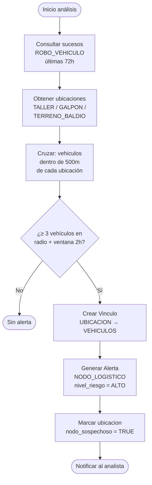
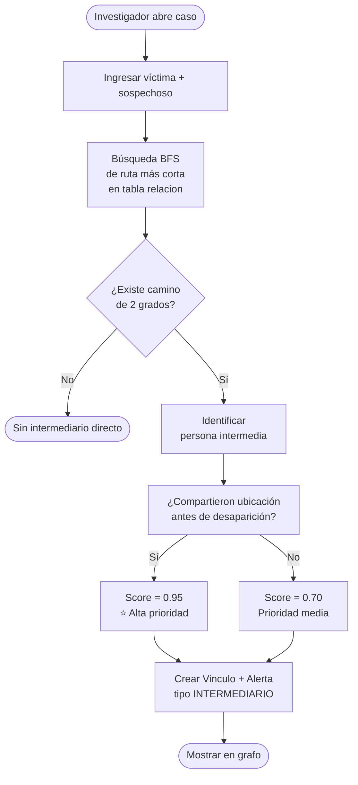
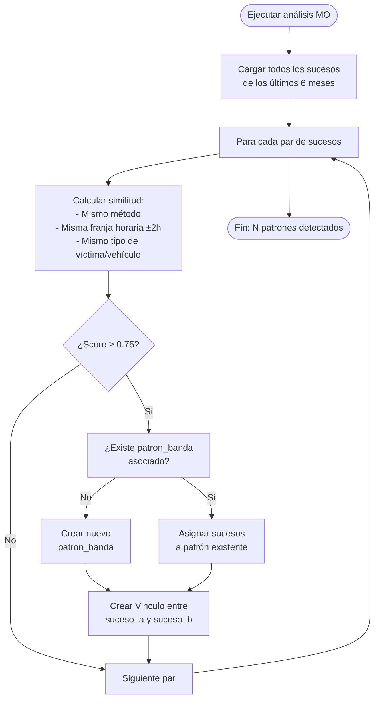

# Flujo del Red Thread Engine

## Caso de Uso A - Nodo Logístico

```mermaid
flowchart TD
    START([Inicio análisis]) --> Q1[Consultar sucesos<br/>ROBO_VEHICULO<br/>últimas 72h]
    Q1 --> Q2[Obtener ubicaciones<br/>TALLER / GALPON /<br/>TERRENO_BALDIO]
    Q2 --> CRUCE[Cruzar: vehiculos<br/>dentro de 500m<br/>de cada ubicación]
    CRUCE --> CHECK{¿≥ 3 vehículos en<br/>radio + ventana 2h?}
    CHECK -->|No| FIN1([Sin alerta])
    CHECK -->|Sí| CREA[Crear Vinculo<br/>UBICACION → VEHICULOS]
    CREA --> ALERT[Generar Alerta<br/>NODO_LOGISTICO<br/>nivel_riesgo = ALTO]
    ALERT --> MARK[Marcar ubicacion<br/>nodo_sospechoso = TRUE]
    MARK --> FIN2([Notificar al analista])
```

## Caso de Uso C - Círculo de Confianza

```mermaid
flowchart TD
    START([Investigador abre caso]) --> IN1[Ingresar víctima + sospechoso]
    IN1 --> BFS[Búsqueda BFS<br/>de ruta más corta<br/>en tabla relacion]
    BFS --> CHECK{¿Existe camino<br/>de 2 grados?}
    CHECK -->|No| FIN1([Sin intermediario directo])
    CHECK -->|Sí| IDENT[Identificar<br/>persona intermedia]
    IDENT --> GEO[¿Compartieron ubicación<br/>antes de desaparición?]
    GEO -->|Sí| SCORE1[Score = 0.95<br/>⭐ Alta prioridad]
    GEO -->|No| SCORE2[Score = 0.70<br/>Prioridad media]
    SCORE1 --> VIN[Crear Vinculo + Alerta<br/>tipo INTERMEDIARIO]
    SCORE2 --> VIN
    VIN --> FIN2([Mostrar en grafo])
```

## Plot Twist - Modus Operandi

```mermaid
flowchart TD
    START([Ejecutar análisis MO]) --> LOAD[Cargar todos los sucesos<br/>de los últimos 6 meses]
    LOAD --> LOOP[Para cada par de sucesos]
    LOOP --> SIM[Calcular similitud:<br/>- Mismo método<br/>- Misma franja horaria ±2h<br/>- Mismo tipo de víctima/vehículo]
    SIM --> UMB{¿Score ≥ 0.75?}
    UMB -->|No| SIG[Siguiente par]
    UMB -->|Sí| BAND[¿Existe patron_banda<br/>asociado?]
    BAND -->|No| CREA[Crear nuevo<br/>patron_banda]
    BAND -->|Sí| ASIG[Asignar sucesos<br/>a patrón existente]
    CREA --> VIN[Crear Vinculo entre<br/>suceso_a y suceso_b]
    ASIG --> VIN
    VIN --> SIG
    SIG --> LOOP
    LOOP --> FIN([Fin: N patrones detectados])
```
