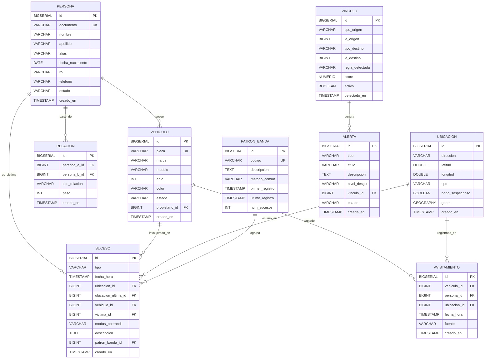

# Modelo Entidad-Relación

```mermaid
erDiagram
    PERSONA ||--o{ VEHICULO : "posee"
    PERSONA ||--o{ SUCESO : "es_victima"
    PERSONA ||--o{ RELACION : "parte_de"
    VEHICULO ||--o{ SUCESO : "involucrado_en"
    VEHICULO ||--o{ AVISTAMIENTO : "captado"
    UBICACION ||--o{ SUCESO : "ocurrio_en"
    UBICACION ||--o{ AVISTAMIENTO : "registrado_en"
    PATRON_BANDA ||--o{ SUCESO : "agrupa"
    VINCULO ||--o{ ALERTA : "genera"

    PERSONA {
        BIGSERIAL id PK
        VARCHAR documento UK
        VARCHAR nombre
        VARCHAR apellido
        VARCHAR alias
        DATE fecha_nacimiento
        VARCHAR rol
        VARCHAR telefono
        VARCHAR estado
        TIMESTAMP creado_en
    }

    VEHICULO {
        BIGSERIAL id PK
        VARCHAR placa UK
        VARCHAR marca
        VARCHAR modelo
        INT anio
        VARCHAR color
        VARCHAR estado
        BIGINT propietario_id FK
        TIMESTAMP creado_en
    }

    UBICACION {
        BIGSERIAL id PK
        VARCHAR direccion
        DOUBLE latitud
        DOUBLE longitud
        VARCHAR tipo
        BOOLEAN nodo_sospechoso
        GEOGRAPHY geom
        TIMESTAMP creado_en
    }

    SUCESO {
        BIGSERIAL id PK
        VARCHAR tipo
        TIMESTAMP fecha_hora
        BIGINT ubicacion_id FK
        BIGINT ubicacion_ultima_id FK
        BIGINT vehiculo_id FK
        BIGINT victima_id FK
        VARCHAR modus_operandi
        TEXT descripcion
        BIGINT patron_banda_id FK
        TIMESTAMP creado_en
    }

    RELACION {
        BIGSERIAL id PK
        BIGINT persona_a_id FK
        BIGINT persona_b_id FK
        VARCHAR tipo_relacion
        INT peso
        TIMESTAMP creado_en
    }

    AVISTAMIENTO {
        BIGSERIAL id PK
        BIGINT vehiculo_id FK
        BIGINT persona_id FK
        BIGINT ubicacion_id FK
        TIMESTAMP fecha_hora
        VARCHAR fuente
        TIMESTAMP creado_en
    }

    VINCULO {
        BIGSERIAL id PK
        VARCHAR tipo_origen
        BIGINT id_origen
        VARCHAR tipo_destino
        BIGINT id_destino
        VARCHAR regla_detectada
        NUMERIC score
        BOOLEAN activo
        TIMESTAMP detectado_en
    }

    ALERTA {
        BIGSERIAL id PK
        VARCHAR tipo
        VARCHAR titulo
        TEXT descripcion
        VARCHAR nivel_riesgo
        BIGINT vinculo_id FK
        VARCHAR estado
        TIMESTAMP creada_en
    }

    PATRON_BANDA {
        BIGSERIAL id PK
        VARCHAR codigo UK
        TEXT descripcion
        VARCHAR metodo_comun
        TIMESTAMP primer_registro
        TIMESTAMP ultimo_registro
        INT num_sucesos
    }
```
