# Diagramas del Sistema
## Nexo Criminal — Sistema de Inteligencia de Precisión

---

**Universidad de Oriente — Núcleo Nueva Esparta**
**Materia:** Sistemas de Información II
**Equipo:** Amarillo

---

## Tabla de Contenido

1. [Diagrama de Arquitectura General](#1-diagrama-de-arquitectura-general)
2. [Diagrama de Componentes Backend](#2-diagrama-de-componentes-backend)
3. [Diagrama Entidad-Relación (Modelo de Datos)](#3-diagrama-entidad-relación-modelo-de-datos)
4. [Diagrama de Casos de Uso](#4-diagrama-de-casos-de-uso)
5. [Diagrama de Clases (Backend)](#5-diagrama-de-clases-backend)
6. [Diagrama de Secuencia: Login](#6-diagrama-de-secuencia-login)
7. [Diagrama de Secuencia: Ejecución del Motor Red Thread](#7-diagrama-de-secuencia-ejecución-del-motor-red-thread)
8. [Diagrama de Secuencia: Consulta a IA Claude](#8-diagrama-de-secuencia-consulta-a-ia-claude)
9. [Diagrama de Flujo: Motor Red Thread](#9-diagrama-de-flujo-motor-red-thread)
10. [Diagrama de Flujo: Subida de Foto](#10-diagrama-de-flujo-subida-de-foto)
11. [Diagrama de Estados: Alerta](#11-diagrama-de-estados-alerta)
12. [Diagrama de Estados: Persona Desaparecida](#12-diagrama-de-estados-persona-desaparecida)
13. [Diagrama de Despliegue](#13-diagrama-de-despliegue)

---

## 1. Diagrama de Arquitectura General

Vista de alto nivel de las tres capas del sistema y su comunicación con servicios externos.

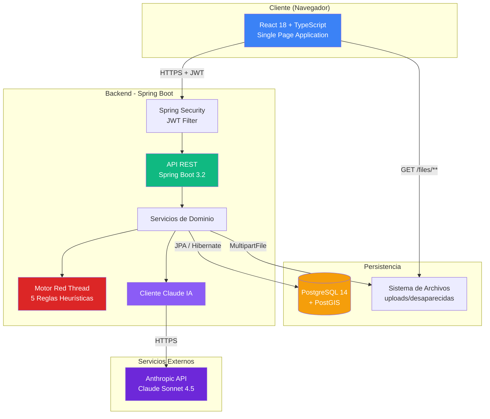

---

## 2. Diagrama de Componentes Backend

Detalle de los paquetes y sus responsabilidades dentro del backend.

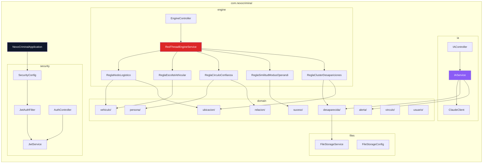

---

## 3. Diagrama Entidad-Relación (Modelo de Datos)

Modelo relacional completo del sistema.

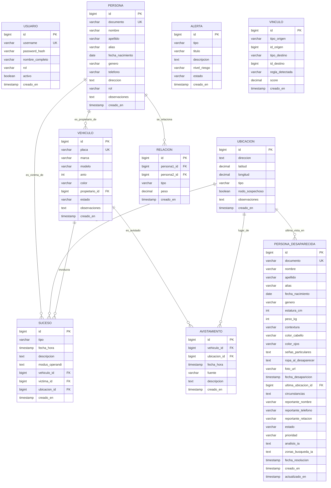

---

## 4. Diagrama de Casos de Uso

Actores principales y operaciones disponibles en el sistema.

```mermaid
graph TB
    subgraph "Sistema Nexo Criminal"
        UC1[Iniciar sesión]
        UC2[Cambiar contraseña]
        UC3[Gestionar Personas]
        UC4[Gestionar Vehículos]
        UC5[Gestionar Ubicaciones]
        UC6[Gestionar Sucesos]
        UC7[Gestionar Personas Desaparecidas]
        UC8[Subir foto de desaparecida]
        UC9[Crear relaciones sociales]
        UC10[Buscar intermediarios]
        UC11[Registrar avistamiento de vehículo]
        UC12[Ejecutar Motor Red Thread]
        UC13[Configurar umbrales del motor]
        UC14[Ver alertas]
        UC15[Cambiar estado de alerta]
        UC16[Visualizar grafo de vínculos]
        UC17[Filtrar grafo por tipo]
        UC18[Consultar Asistente IA]
        UC19[Generar reporte ejecutivo IA]
        UC20[Predecir zonas de búsqueda IA]
        UC21[Exportar datos a CSV]
        UC22[Búsqueda global]
        UC23[Gestionar usuarios]
        UC24[Ver dashboard]
    end

    ANALISTA((👤 Analista))
    ADMIN((👤 Administrador))
    IA_EXT((🤖 Anthropic Claude))

    ANALISTA --> UC1
    ANALISTA --> UC2
    ANALISTA --> UC3
    ANALISTA --> UC4
    ANALISTA --> UC5
    ANALISTA --> UC6
    ANALISTA --> UC7
    ANALISTA --> UC8
    ANALISTA --> UC9
    ANALISTA --> UC10
    ANALISTA --> UC11
    ANALISTA --> UC12
    ANALISTA --> UC14
    ANALISTA --> UC15
    ANALISTA --> UC16
    ANALISTA --> UC17
    ANALISTA --> UC18
    ANALISTA --> UC19
    ANALISTA --> UC20
    ANALISTA --> UC21
    ANALISTA --> UC22
    ANALISTA --> UC24

    ADMIN --> UC1
    ADMIN --> UC2
    ADMIN --> UC13
    ADMIN --> UC23
    ADMIN --> UC24

    UC18 -.->|API REST| IA_EXT
    UC19 -.->|API REST| IA_EXT
    UC20 -.->|API REST| IA_EXT

    style ANALISTA fill:#3B82F6,color:#fff
    style ADMIN fill:#DC2626,color:#fff
    style IA_EXT fill:#8B5CF6,color:#fff
```

---

## 5. Diagrama de Clases (Backend)

Vista simplificada de las clases principales del backend.

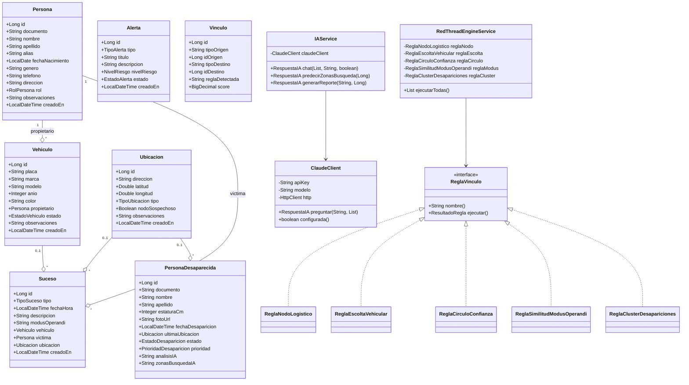

---

## 6. Diagrama de Secuencia: Login

Flujo de autenticación con JWT.

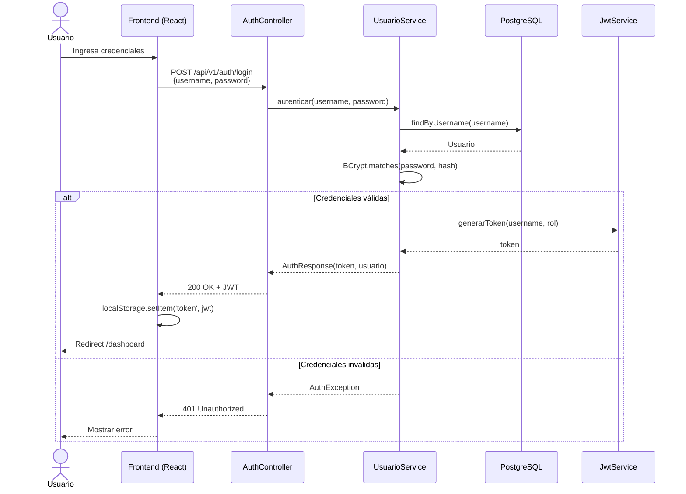

---

## 7. Diagrama de Secuencia: Ejecución del Motor Red Thread

Flujo completo cuando el analista ejecuta el motor.

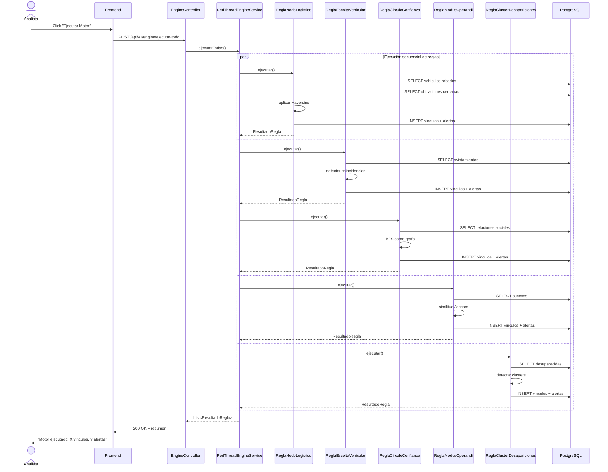

---

## 8. Diagrama de Secuencia: Consulta a IA Claude

Flujo cuando el analista consulta el asistente IA.

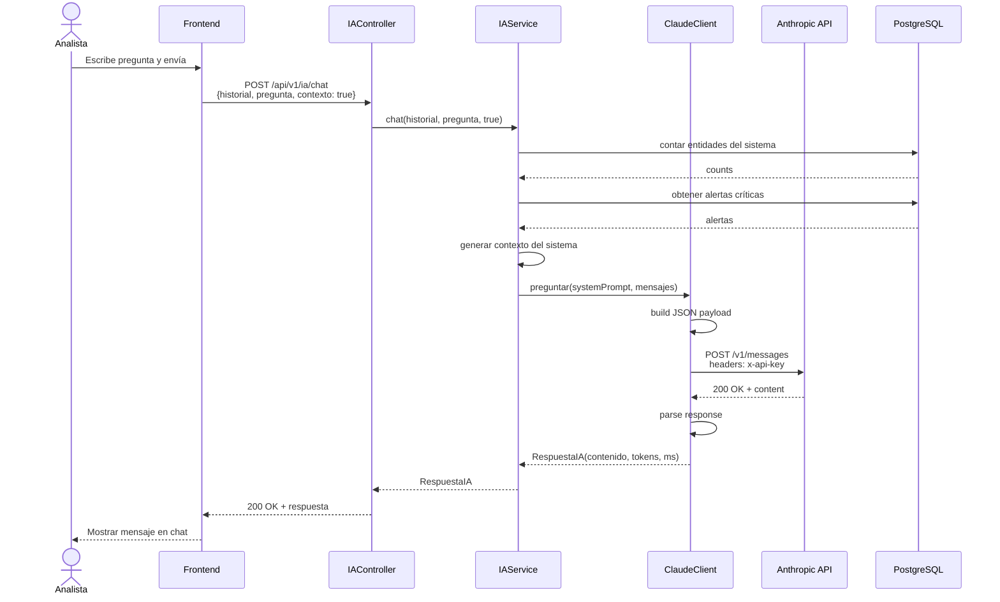

---

## 9. Diagrama de Flujo: Motor Red Thread

Lógica detallada de la ejecución del motor.

```mermaid
flowchart TD
    START([Inicio: Click 'Ejecutar Motor']) --> INIT[Inicializar lista de resultados]
    INIT --> R1{Regla 1<br/>Nodo Logístico}

    R1 --> R1_LOAD[Cargar vehículos robados<br/>+ ubicaciones]
    R1_LOAD --> R1_LOOP[Para cada ubicación]
    R1_LOOP --> R1_CHECK{Hay 3+ vehículos<br/>en radio 500m<br/>en 72h?}
    R1_CHECK -->|Sí| R1_SAVE[Crear vínculos<br/>+ Alerta CRITICO]
    R1_CHECK -->|No| R1_NEXT[Siguiente ubicación]
    R1_SAVE --> R1_NEXT
    R1_NEXT --> R1_END{Más ubicaciones?}
    R1_END -->|Sí| R1_LOOP
    R1_END -->|No| R2

    R2{Regla 2<br/>Escolta Vehicular} --> R2_LOAD[Cargar avistamientos]
    R2_LOAD --> R2_CHECK{Vehículo no robado<br/>aparece 3+ veces<br/>cerca de robados?}
    R2_CHECK -->|Sí| R2_SAVE[Crear vínculos<br/>+ Alerta ALTO]
    R2_CHECK -->|No| R3
    R2_SAVE --> R3

    R3{Regla 3<br/>Círculo Confianza} --> R3_LOAD[Cargar relaciones]
    R3_LOAD --> R3_BFS[BFS víctima → sospechoso<br/>profundidad 2]
    R3_BFS --> R3_CHECK{Existe<br/>intermediario?}
    R3_CHECK -->|Sí| R3_SAVE[Crear vínculo<br/>+ Alerta MEDIO]
    R3_CHECK -->|No| R4
    R3_SAVE --> R4

    R4{Regla 4<br/>Modus Operandi} --> R4_LOAD[Cargar sucesos]
    R4_LOAD --> R4_JACCARD[Calcular similitud<br/>Jaccard sobre tokens]
    R4_JACCARD --> R4_CHECK{Similitud<br/>≥ 0.75?}
    R4_CHECK -->|Sí| R4_SAVE[Crear vínculo<br/>+ Alerta ALTO]
    R4_CHECK -->|No| R5
    R4_SAVE --> R5

    R5{Regla 5<br/>Cluster Desapariciones} --> R5_LOAD[Cargar desaparecidas<br/>activas]
    R5_LOAD --> R5_CHECK{3+ desapariciones<br/>en radio 1.5km<br/>en 30 días?}
    R5_CHECK -->|Sí| R5_SAVE[Crear vínculos<br/>+ Alerta CRITICO]
    R5_CHECK -->|No| R5_NODOS[Verificar cercanía<br/>a nodos sospechosos]
    R5_SAVE --> R5_NODOS
    R5_NODOS --> R5_NCHECK{Desaparición<br/>≤ 1km de<br/>nodo sospechoso?}
    R5_NCHECK -->|Sí| R5_NSAVE[Crear vínculo<br/>+ Alerta ALTO]
    R5_NCHECK -->|No| END
    R5_NSAVE --> END

    END([Fin: Retornar resumen<br/>X vínculos, Y alertas])

    style START fill:#10B981,color:#fff
    style END fill:#10B981,color:#fff
    style R1 fill:#DC2626,color:#fff
    style R2 fill:#DC2626,color:#fff
    style R3 fill:#DC2626,color:#fff
    style R4 fill:#DC2626,color:#fff
    style R5 fill:#DC2626,color:#fff
```

---

## 10. Diagrama de Flujo: Subida de Foto

Proceso de subida y persistencia de fotografía de persona desaparecida.

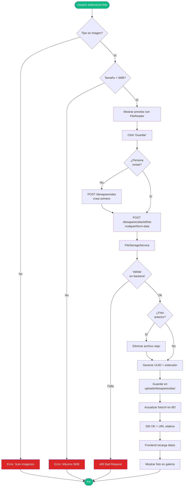

---

## 11. Diagrama de Estados: Alerta

Ciclo de vida de una alerta generada por el motor.

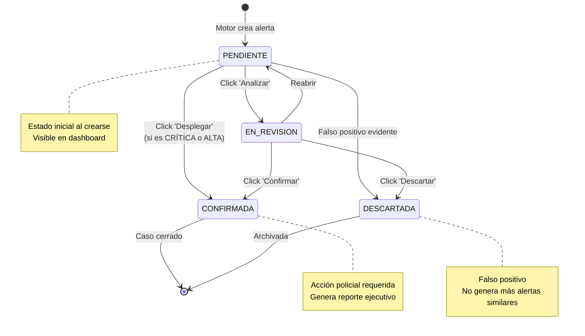

---

## 12. Diagrama de Estados: Persona Desaparecida

Estados de un caso de desaparición.

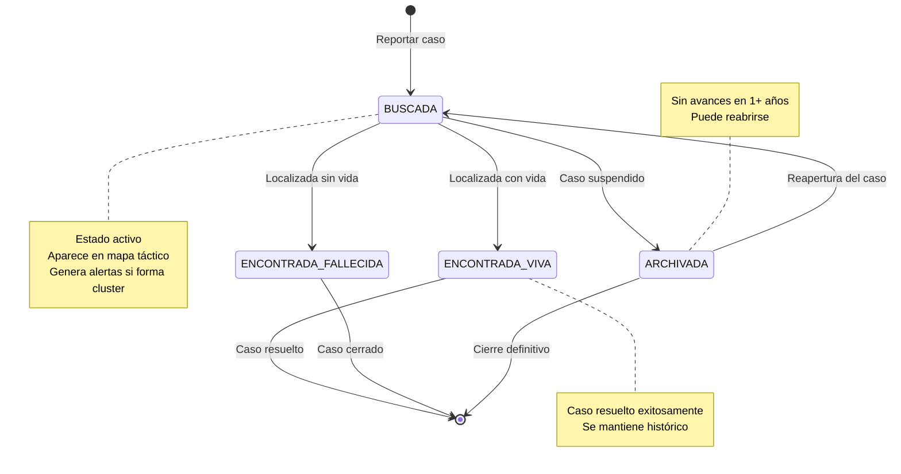

---

## 13. Diagrama de Despliegue

Vista de cómo se despliega el sistema en un ambiente de producción típico.

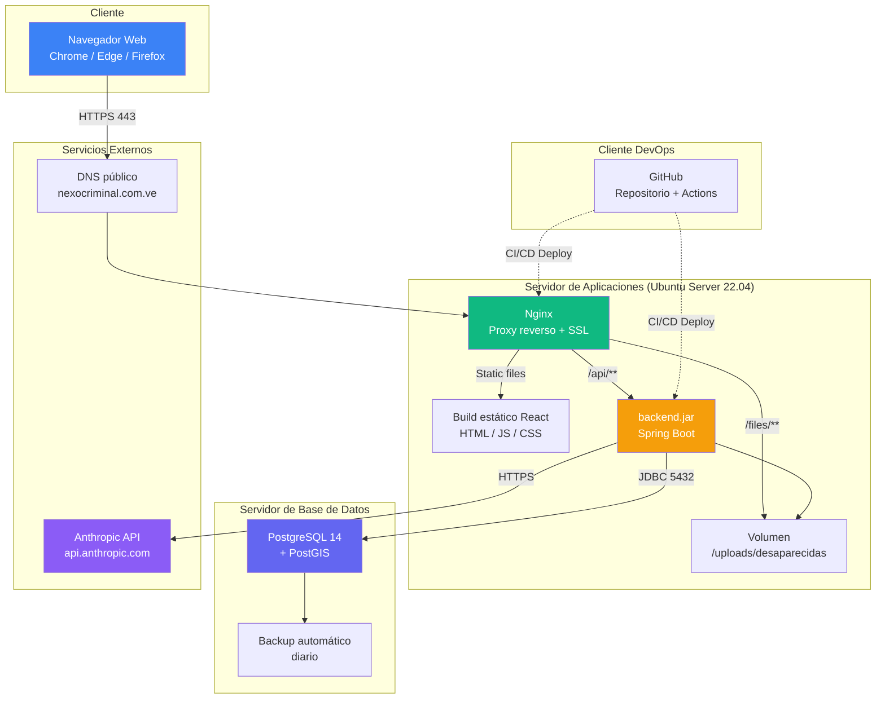

---

## Notas sobre los diagramas

- Todos los diagramas están escritos en sintaxis **Mermaid**, que GitHub renderiza nativamente al visualizar archivos `.md`.
- Para visualizar fuera de GitHub, podés usar **https://mermaid.live** y pegar cualquier bloque.
- Los diagramas son **vivos**: se actualizan automáticamente al modificar el código fuente del archivo.
- Para exportar a PNG/SVG, podés usar la extensión "Mermaid Markdown Syntax Highlighting" en VS Code.

---

*Diagramas elaborados por el equipo amarillo — Sistemas de Información II — Universidad de Oriente, Núcleo Nueva Esparta.*